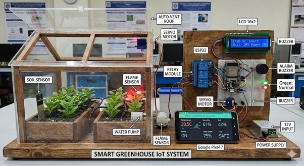
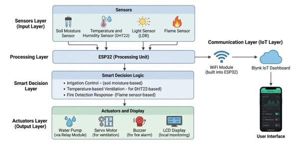
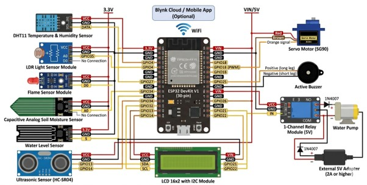
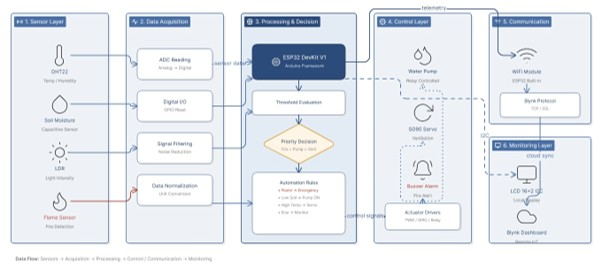
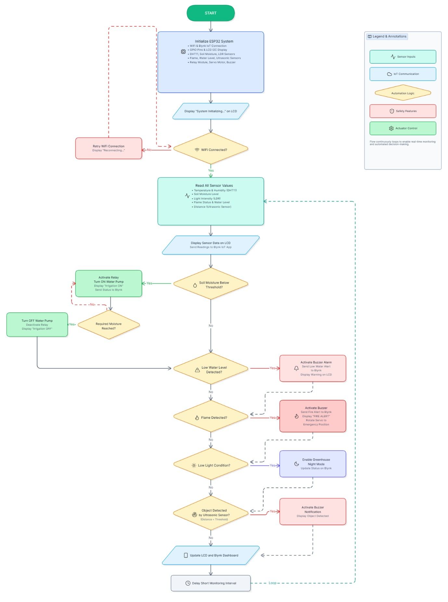
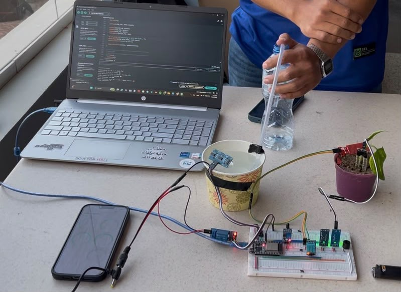
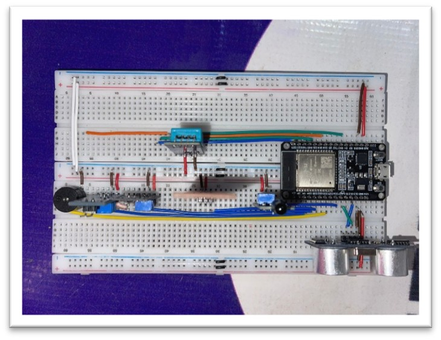

# 🌱 IoT-Based Smart Irrigation & Greenhouse Monitoring System


An IoT-enabled Smart Greenhouse Monitoring and Irrigation System developed using **ESP32**. The system automates irrigation, monitors environmental conditions, detects fire hazards, and enables real-time remote monitoring through the **Blynk IoT Platform**.

---

# 📑 Table of Contents

- [Overview](#-overview)
- [Project Concept](#-project-concept)
- [Features](#-features)
- [Hardware Components](#-hardware-components)
- [System Architecture](#-system-architecture)
- [Software & Tools](#-software--tools)
- [System Workflow](#-system-workflow)
- [Project Structure](#-project-structure)
- [Documentation](#-documentation)
- [Project Demonstration](#-project-demonstration)
- [Hardware Prototype](#-hardware-prototype)
- [Future Improvements](#-future-improvements)
- [Author](#-author)

---

# 📌 Overview

Modern agriculture increasingly relies on intelligent automation to improve productivity while reducing water consumption and minimizing manual intervention.

This project presents an **IoT-Based Smart Irrigation & Greenhouse Monitoring System** capable of monitoring environmental conditions, automatically controlling irrigation and greenhouse ventilation, detecting fire hazards, and providing real-time cloud monitoring using the **Blynk IoT Platform**.

---
# 🚀 Project Highlights

- 🌱 Fully automated smart irrigation based on soil moisture readings.
- 📡 Real-time monitoring through the Blynk IoT platform.
- 🔥 Integrated fire detection with buzzer alarm.
- 📄 Complete documentation, diagrams, source code, and demonstration video included.

# 🌟 Project Concept

The following illustration represents the envisioned appearance of the proposed smart greenhouse system.

> **Note:** This image is AI-generated and is provided only for conceptual visualization. The actual implemented prototype is shown later in this document.

<p align="center">
  
</p>

---

# ✨ Features

- 🌱 Automatic irrigation based on soil moisture
- 🌡️ Temperature & humidity monitoring
- 💡 Ambient light monitoring
- 🌧️ Rain detection
- 🚰 Water tank level monitoring
- 🔥 Fire detection with buzzer alarm
- 🪟 Automatic greenhouse ventilation using a servo motor
- ☁️ Real-time cloud monitoring via Blynk IoT
- 📟 Live sensor diagnostics through the Serial Monitor
- ⚡ Autonomous real-time operation

---

# 🛠 Hardware Components

| Component | Function |
|------------|----------|
| ESP32 Dev Board | Main Controller |
| DHT11 | Temperature & Humidity Sensor |
| Soil Moisture Sensor | Irrigation Control |
| LDR | Light Detection |
| Water Sensor | Rain Detection |
| Flame Sensor | Fire Detection |
| HC-SR04 Ultrasonic Sensor | Water Tank Level Monitoring |
| Servo Motor SG90 | Greenhouse Window Control |
| Relay Module | Pump Switching |
| Water Pump | Irrigation |
| LCD 16x2 I2C | Local Display |
| Active Buzzer | Alarm System |

---

# 🏗️ System Architecture

<p align="center">
  
</p>

---

# 🔌 Hardware Block Diagram

<p align="center">
  
</p>

---

# 💻 Software Architecture

<p align="center">
  
</p>

---

# 🔄 System Flowchart

<p align="center">
  
</p>

---

# 💻 Software & Tools

- Arduino IDE
- ESP32 Arduino Core
- Blynk IoT Platform
- Wokwi Simulator

---

# ⚙️ System Workflow

```text
Read Sensor Data
        │
        ▼
Process Sensor Values
        │
        ▼
Decision Making
        │
 ┌──────┴─────────┐
 │                │
 ▼                ▼
Control Pump   Control Servo
 │                │
 └──────┬─────────┘
        ▼
Update Blynk Dashboard
        ▼
Display Data & Alerts
```

---

# 📂 Project Structure

```
IoT-Smart-Irrigation-System
│
├── Assets
│   ├── ai-generated-prototype.jpg
│   ├── blynk-dashboard.jpeg
│   ├── hardware-connections.jpg
│   └── prototype.jpeg
│
├── Code
│   └── smart-irrigation-system.ino
│
├── Diagrams
│   ├── hardware-block-diagram.jpg
│   ├── software-architecture.jpg
│   ├── system-architecture.jpg
│   └── system-flowchart.jpg
│
├── Documentation
│   └── IoT-Smart-Irrigation-System-Report.pdf
│
├── README.md
└── LICENSE
```

---

# 🔗 Quick Links

- 💻 **Source Code:** [Code/smart-irrigation-system.ino](Code/smart-irrigation-system.ino)
- 📄 **Technical Report:** [Documentation/IoT-Smart-Irrigation-System-Report.pdf](Documentation/IoT-Smart-Irrigation-System-Report.pdf)
- 🎥 **Project Demo:** [Watch Demo Video](https://drive.google.com/file/d/1THavF8XfbiDCVQ4fUKIMlvT7Og5ExhPg/view?usp=drivesdk)

# 📄 Documentation

The complete technical report describing the project architecture, implementation, testing, and evaluation is available in the **Documentation** folder.

---
# 🎥 Project Demonstration

Watch the complete demonstration of the system in action.

[](https://drive.google.com/file/d/1THavF8XfbiDCVQ4fUKIMlvT7Og5ExhPg/view?usp=drivesdk) 
---

# 📷 Hardware Prototype

The following image shows the actual hardware prototype during implementation and testing.

<p align="center">
  
</p>

---

# 🔌 Hardware Connections

<p align="center">
  
</p>

---

# 🚀 Future Improvements

- Weather API integration
- MQTT communication
- Mobile push notifications
- AI-based irrigation prediction
- Solar-powered operation
- Historical data logging
- Cloud analytics dashboard

---

# 👨‍💻 Author

**Ahmed Samir**

Electronics & Communications Engineering Student

Nile University

📍 Giza, Egypt

---
⭐ If you found this project useful or interesting, consider giving this repository a star.
